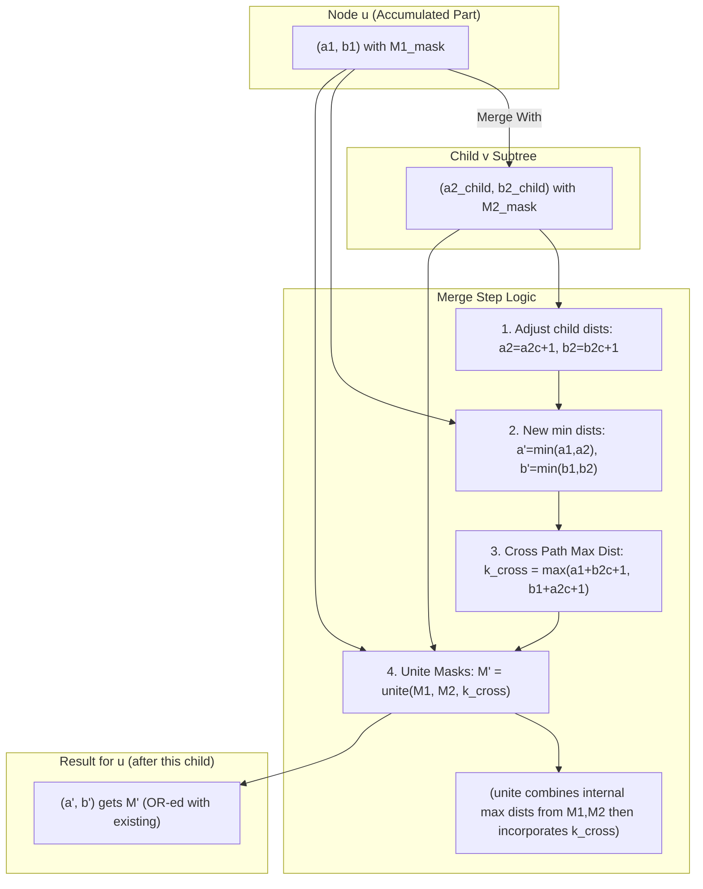

# Codeforces 2101F - Shoo Shatters the Sunshine

This repository contains a Python 3.9.13 compatible solution attempt for the Codeforces problem [2101F - Shoo Shatters the Sunshine](https://codeforces.com/problemset/problem/2101/F).

**Disclaimer: Current Status (Mismatch with Examples)**

As of the last update, the implemented solution produces outputs that do **not** match the provided examples or manually calculated small test cases (e.g., for N=2, output is 4, expected is 2; for N=3 path, output is 36, expected is 18).

The core issue is suspected to be in how the number of colorings $f(D)$ (colorings with coolness $\le D$) is derived from the DP state. The current DP uses bitmasks to store the *possibility* of achieving a certain internal max distance $m$, but $f(D)$ requires *counting* the number of colorings. The "sum popcounts" method described in the problem interpretation might be a simplification or implies a DP structure that correctly aggregates counts, which the current bitmask OR-ing logic does not do for multiple colorings leading to the same $(a,b)$ state and same $m$ value.

A DP state that explicitly stores counts (e.g., $dp[u][a][b][m] = \text{count}$) would be $O(N^4)$ states, and merging children would be $O(N^6)$ without optimization. Bitset acceleration typically targets optimizing the operations on the $m$ dimension for such counting DPs, often involving techniques like generating functions or specialized convolutions if the update rule for $m$ allows.

Despite the discrepancy, this README documents the attempted approach based on an interpretation of a bitset-accelerated DP. Further investigation is needed to align the DP state and transitions with the requirement of counting colorings correctly.

## Problem Statement

You are given a tree with $N$ vertices ($2 \le N \le 3000$). Each vertex can be colored red, blue, or white.
The **coolness** of a coloring is defined as the maximum distance $d(u, v)$ over all pairs of vertices $(u, v)$ where $u$ is red and $v$ is blue. If there are no red vertices or no blue vertices, the coolness is zero.
The distance $d(u,v)$ is the number of edges on the unique simple path between $u$ and $v$.

Your task is to calculate the sum of coolness over all $3^N$ possible colorings of the tree, modulo 998244353.
The sum of $N$ over all test cases does not exceed 3000.

## Solution Approach (Attempted)

The problem asks for the sum of maximum red-blue distances over all $3^N$ colorings. The general strategy is:
$$ \text{Sum} = (N-1) \cdot 3^N - \sum_{D=0}^{N-2} f(D) $$
where $f(D) = (\text{# colorings with coolness } \le D)$. The core of the solution is to compute $f(D)$ using Dynamic Programming on Trees.

### Dynamic Programming State (Bitmask-based Interpretation)

We perform a Depth First Search (DFS). For each node $u$, the state $dp[u][a][b]$ stores a bitmask.
-   `u`: Current node.
-   `a`: Min distance from $u$ to a **red** vertex in its processed subtree ($N$ if none).
-   `b`: Min distance from $u$ to a **blue** vertex in its processed subtree ($N$ if none).
-   The value $dp[u][a][b]$ is an integer (bitmask) where the $k$-th bit is set if $k$ is a *possible* value for the maximum red-blue distance *entirely within* $u$'s processed subtree.

### DP Transitions

1.  **Base Case (Node $u$ itself):**
    -   If $u$ is white: $dp_u[(N, N)]$ has bit 0 set (for $m=0$).
    -   If $u$ is red: $dp_u[(0, N)]$ has bit 0 set.
    -   If $u$ is blue: $dp_u[(N, 0)]$ has bit 0 set.

2.  **Merging Child Subtree $v$ into $u$'s accumulated DP:**
    For each state $(a_1, b_1)$ with mask $M_1$ from $u$'s current DP and $(a_{2c}, b_{2c})$ with mask $M_2$ from $v$'s DP:
    -   Adjust child distances: $a_2 = a_{2c} + 1$, $b_2 = b_{2c} + 1$.
    -   New min distances: $a' = \min(a_1, a_2)$, $b' = \min(b_1, b_2)$.
    -   Max cross-path distance ($k_{cross}$): $k_{cross} = \max(a_1 + b_{2c} + 1, b_1 + a_{2c} + 1)$ (if applicable, capped at $N-1$).
    -   New $m$-mask ($M')$ for $(a',b')$: $M' = \text{unite}(M_1, M_2, k_{cross})$.
        The `unite` function combines $M_1, M_2$ to get $M_{12} = \{ \max(m_x, m_y) \}$, then forms $M' = \{ \max(m, k_{cross}) \mid m \in M_{12} \}$. This uses prefix-ORs of bitmasks.
    -   The resulting mask $M'$ is bitwise OR-ed into $dp_{new}[(a',b')]$.

### Final Calculation (Interpreted for Bitmask DP)

$f(D) = \sum_{(a,b) \in dp_{root}} \text{popcount}(dp_{root}[(a,b)] \text{ & mask\_bits\_le\_D})$.
The final answer is $\left( (N-1) \cdot 3^N - \sum_{D=0}^{N-2} f(D) \right) \pmod{998244353}$.
**Note:** As stated in the disclaimer, this method of calculating $f(D)$ is suspected to be the source of the discrepancy, as it counts distinct $( (a,b), m \le D)$ pairs rather than total colorings.

### Complexity (of this attempted approach)

-   States $(a,b)$: $O(S_u^2)$ for a subtree of size $S_u$.
-   Merge: $K^2 \cdot S_c^2$ pairs. Bitmask operations (length $N$):
    -   Python: `get_prefix_ORs` is $O(N \cdot \text{N/W})$, `unite` is similar.
-   Overall: Potentially $O(N^4 \cdot N/W)$ or $O(N^5 \cdot N/W)$ without Sack optimization. Python's large integer overhead further impacts performance.

### Visualization of DP Merge (Conceptual for Bitmasks)

